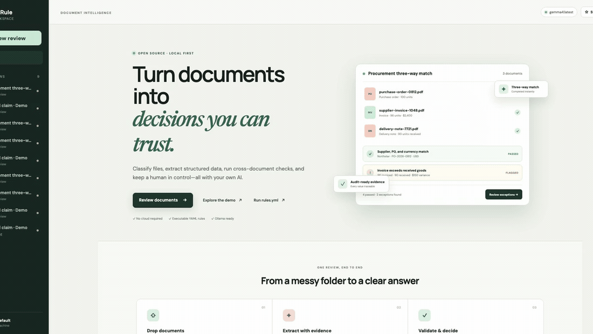
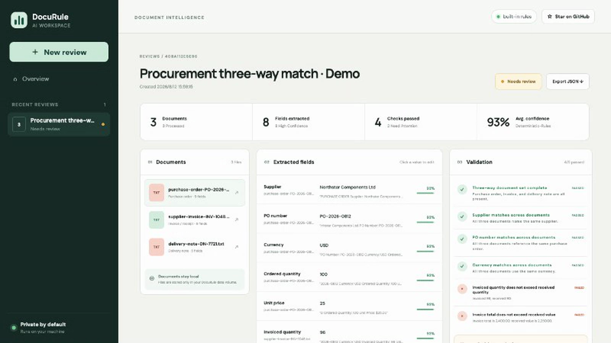

<p align="center">
  
</p>

<h1 align="center">DocuRule</h1>

<h3 align="center">Turn document packets into auditable decisions.</h3>

<p align="center">
  Open-source, local-first document intelligence that classifies mixed files, extracts<br />
  grounded data, checks cross-document rules, and keeps a human in control.
</p>

<p align="center">
  <a href="https://wangyinlong-wang.github.io/docurule-ai/"><strong>Live showcase</strong></a> ·
  <a href="#-quick-start">Quick start</a> ·
  <a href="#-see-it-work">See it work</a> ·
  <a href="#run-your-own-recipe">YAML recipes</a> ·
  <a href="docs/product-spec.md">Product spec</a> ·
  <a href="README.zh-CN.md">中文</a>
</p>

<p align="center">
  <a href="https://github.com/wangyinlong-wang/docurule-ai/actions/workflows/ci.yml"></a>
  <a href="LICENSE"></a>
  <a href="https://www.python.org/"></a>
  <a href="https://ollama.com/"></a>
</p>

[](https://github.com/wangyinlong-wang/docurule-ai/releases/latest) **v0.3: upload and execute your own safe `rules.yml` recipes.**



**rules.yml · 3 documents · 8 normalized fields · 6 rules · 2 exceptions · 1 review decision**

> [!NOTE]
> DocuRule is an early, working MVP. The bundled demo is deterministic and needs no API key. Image-only documents need a local vision model or an OpenAI-compatible provider.

> [!WARNING]
> The current MVP has no authentication. Run it only on a trusted machine or private network; do not expose port `8080` directly to the public internet.

## Why DocuRule?

OCR and PDF-to-JSON solve only half of document automation. Real workflows receive a **packet** of related files and still need to answer:

- Do the names, dates, identifiers, and amounts agree across documents?
- Which value failed, where did it come from, and how confident was the extraction?
- Can deterministic checks stay deterministic instead of being delegated to an LLM?
- Can a reviewer correct a value, approve the result, and export the evidence trail?

DocuRule starts at that missing layer. It complements parsers such as Docling, PaddleOCR, and Marker; it is not another parser benchmark.

| | Typical extractor | DocuRule |
|---|---|---|
| Unit of work | One file | A related document packet |
| Output | Text / JSON | Fields + evidence + validations + decision |
| Rules | Prompt-heavy | Deterministic first, AI where useful |
| Review | Build it yourself | Exception-oriented review workspace |
| Deployment | Often cloud-first | Docker + local storage + Ollama |

## ✨ See it work

**[Try the browser-only live showcase →](https://wangyinlong-wang.github.io/docurule-ai/)** It uses the public synthetic packet, makes no uploads, calls no backend, and forgets the review when the tab reloads. Run DocuRule locally to upload files or connect an AI provider.

Click **Explore the demo** after startup. DocuRule creates a synthetic procurement packet and runs a complete three-way match:

1. Classifies a purchase order, supplier invoice, and delivery note.
2. Extracts supplier, PO, currency, quantity, unit-price, and total fields with source quotes.
3. Runs six deterministic checks and surfaces two exceptions: invoiced quantity and amount exceed the goods received.
4. Lets a reviewer correct received quantity from `90` to `96`, immediately re-runs the rules, and records the final decision.



All identifiers, organizations, quantities, and amounts in the demo are fictional. The sample deliberately skips the AI provider, so its result is fast and reproducible even when Ollama is offline.

The exact synthetic documents, declarative rule contract, and golden JSON result are public in the [three-way-match recipe](demo/three-way-match/). The built-in API demo and deterministic tests read these same files.

## 🚀 Quick start

Requirements: Docker Desktop with Docker Compose.

```bash
git clone https://github.com/wangyinlong-wang/docurule-ai.git
cd docurule-ai
docker compose up --build
```

Open [http://localhost:8080](http://localhost:8080), then click **Explore the demo**.

The demo works even when Ollama is offline. To process scans and images with local AI:

```bash
ollama serve
ollama pull gemma4:latest
docker compose up --build
```

Your files and SQLite database live only in the `docurule-data` Docker volume by default. If you configure a remote OpenAI-compatible provider, document inputs are sent to the endpoint you specify.

### Run your own recipe

Click **Run rules.yml** in the workspace, select a schema-v1 recipe, and add the text documents declared by that recipe. You can also run the public sample through the API:

```bash
curl -F 'recipe=@demo/three-way-match/rules.yml' \
  -F 'files=@demo/three-way-match/purchase-order-PO-2026-0812.txt;type=text/plain' \
  -F 'files=@demo/three-way-match/supplier-invoice-INV-1048.txt;type=text/plain' \
  -F 'files=@demo/three-way-match/delivery-note-DN-7721.txt;type=text/plain' \
  http://localhost:8080/api/v1/recipes/run
```

The v1 runtime is intentionally constrained: recipes cannot execute Python, shell commands, templates, or network calls. It supports required document kinds, normalized equality across documents, and numeric `less_than_or_equal` expressions (including multiplication). Uploaded recipe packets currently accept UTF-8 TXT, Markdown, and CSV files whose names exactly match the manifest. See the [recipe authoring guide](docs/recipes.md).

### Run without Docker

```bash
# API
python3 -m venv .venv
.venv/bin/pip install -r apps/api/requirements-dev.txt
DOCURULE_AI_PROVIDER=local .venv/bin/uvicorn docurule.main:app \
  --app-dir apps/api/src --reload --port 8000

# Web, in a second terminal
npm install --prefix apps/web
npm run dev --prefix apps/web
```

Visit [http://localhost:5173](http://localhost:5173). Python 3.11+ and Node.js 22+ are recommended.

## How it works

```text
PDF / image / text packet
          │
          ▼
  classify & extract ──────► source evidence + confidence
          │
          ▼
 normalize packet fields
          │
          ▼
 deterministic validations ─► passed / warning / failed
          │
          ▼
 human review & correction ──► auditable JSON decision
```

The current MVP keeps its architecture deliberately small: React + TypeScript, FastAPI, SQLite, local file storage, and one application container. The provider boundary supports Ollama's native API and OpenAI-compatible chat-completion APIs. See [the architecture](docs/architecture.md) for the scaling path.

## Features available today

- Mixed PDF, PNG, JPG, Markdown, and text uploads (20 MB per file by default)
- Text-layer PDF extraction with `pypdf`
- Vision extraction through Ollama or an OpenAI-compatible provider
- Graceful rules-only fallback when the model is unavailable
- Packet-level field normalization with confidence and source quotes
- Procurement three-way-match checks for document presence, supplier, PO, currency, quantity, and received value
- Executable schema-v1 YAML recipes with a safe, allowlisted rule runtime
- Public three-way-match recipe with synthetic inputs, `rules.yml`, and a CI-checked golden result
- Medical-claim sample with cross-document presence, name, and amount validations
- Editable extracted values and human approve/reject decisions
- Persistent local cases and exportable JSON audit records
- Responsive web workspace and interactive OpenAPI docs at `/docs`
- One-container Docker Compose deployment

## AI providers

Copy `.env.example` to `.env` only when overriding defaults.

| Mode | Configuration | Best for |
|---|---|---|
| Local rules | `DOCURULE_AI_PROVIDER=local` | Demo, CI, text documents |
| Ollama | `DOCURULE_AI_PROVIDER=ollama` | Private local text/vision extraction |
| OpenAI-compatible | `DOCURULE_AI_PROVIDER=openai-compatible` | vLLM, LiteLLM, OpenAI-style endpoints |

```env
DOCURULE_AI_PROVIDER=openai-compatible
DOCURULE_AI_BASE_URL=https://your-endpoint.example/v1
DOCURULE_AI_MODEL=your-vision-model
DOCURULE_AI_API_KEY=your-key
```

Provider errors never silently invent document data. DocuRule falls back to its deterministic text rules and exposes the active engine in the review.

## API

The browser uses the same small HTTP API available to integrations:

```bash
curl -F 'name=Invoice review' \
  -F 'files=@invoice.pdf' \
  -F 'files=@claim-form.png' \
  http://localhost:8080/api/v1/cases
```

Useful endpoints:

| Method | Endpoint | Purpose |
|---|---|---|
| `POST` | `/api/v1/cases` | Upload and process a packet |
| `POST` | `/api/v1/recipes/run` | Run an uploaded YAML recipe against matching text files |
| `GET` | `/api/v1/recipes/three-way-match` | Read the bundled executable recipe contract |
| `POST` | `/api/v1/demo/procurement` | Create the procurement three-way-match sample |
| `POST` | `/api/v1/demo` | Create the secondary medical-claim sample |
| `GET` | `/api/v1/cases/{id}` | Read fields, evidence, and results |
| `PATCH` | `/api/v1/cases/{id}/fields/{key}` | Correct and confirm a field |
| `POST` | `/api/v1/cases/{id}/review` | Approve or reject |
| `GET` | `/api/v1/cases/{id}/export` | Export the audit JSON |

Open [http://localhost:8080/docs](http://localhost:8080/docs) for the generated API reference.

## Roadmap

- [x] Deterministic end-to-end demo and human review workspace
- [x] Ollama and OpenAI-compatible provider boundary
- [x] Docker deployment, persistence, tests, and JSON export
- [x] Procurement three-way-match recipe (PO + invoice + delivery note)
- [x] Executable schema-v1 YAML recipes for deterministic text packets
- [ ] Additional recipe operators, visual authoring, and PDF/image recipe packets
- [ ] PDF coordinate highlights and page preview
- [ ] Docling/PaddleOCR parser adapters
- [ ] Durable worker, PostgreSQL/S3 ports, and multi-user review queues

The detailed scope and acceptance gates live in the [product spec](docs/product-spec.md). Feature requests are welcome, especially reproducible document-packet recipes.

## Contributing

DocuRule is intentionally early: thoughtful issues, sample recipes, provider adapters, and documentation fixes have outsized impact. Read [CONTRIBUTING.md](CONTRIBUTING.md), then look for [`good first issue`](https://github.com/wangyinlong-wang/docurule-ai/labels/good%20first%20issue).

Please use synthetic or fully anonymized documents in issues and pull requests. See [SECURITY.md](SECURITY.md) for private vulnerability reporting.

## License

MIT. See [LICENSE](LICENSE).

---

<p align="center">
  If DocuRule is useful for your document workflow, a ⭐ helps other builders discover it.
</p>
