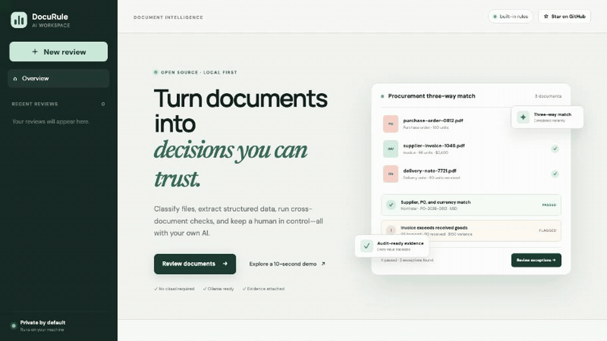

<p align="center">
  
</p>

<h1 align="center">DocuRule</h1>

<h3 align="center">把一组业务文档变成可追溯的规则结论。</h3>

<p align="center">
  开源、本地优先的文档智能工作台：文档分类、字段提取、跨文档核验、人工复核和审计导出。
</p>

<p align="center"><a href="README.md">English</a> · <a href="#快速开始">快速开始</a> · <a href="docs/product-spec.md">产品规格</a></p>



**3 份文档 · 8 个归一化字段 · 6 条规则 · 2 个异常 · 1 次人工决定**

> [!WARNING]
> 当前 MVP 尚无登录认证。请只在可信本机或私有网络运行，不要把 `8080` 端口直接暴露到公网。

## 它解决什么问题

OCR 或 PDF 转 JSON 只完成了一半工作。真实业务面对的是一组有关联的资料：姓名、日期、编号和金额是否一致？异常值来自哪一页？规则为什么失败？谁修改并批准了结果？

DocuRule 专注解析后的业务核验层：

- 一次处理一组有关联的 PDF、图片和文本，而不是单个文件；
- 字段保留置信度和原文证据；
- 相等、金额、日期等确定性规则不交给 LLM 猜；
- 只把异常交给人工修改、批准或拒绝；
- 默认 Docker 本地运行，支持 Ollama，无云端密钥也能体验 Demo。

## 快速开始

需要 Docker Desktop 和 Docker Compose：

```bash
git clone https://github.com/wangyinlong-wang/docurule-ai.git
cd docurule-ai
docker compose up --build
```

访问 [http://localhost:8080](http://localhost:8080)，点击「Explore the demo」。内置演示会创建采购订单、供应商发票和收货单，固定得到 4 条通过、2 条异常；把 `Received quantity` 从 `90` 改为 `96` 后，六条规则全部通过。它不需要模型、API Key 或真实文档。

三份合成文档、声明式规则契约和 golden JSON 结果全部公开在[三单匹配 recipe](demo/three-way-match/)中。内置 API Demo 与确定性测试读取的也是同一组文件。

### 运行自己的 YAML 规则

在首页点击「Run rules.yml」，选择 schema v1 的 `rules.yml`，再选择清单中声明的文本文件，即可创建一条可复核流程。也可以直接调用 API：

```bash
curl -F 'recipe=@demo/three-way-match/rules.yml' \
  -F 'files=@demo/three-way-match/purchase-order-PO-2026-0812.txt;type=text/plain' \
  -F 'files=@demo/three-way-match/supplier-invoice-INV-1048.txt;type=text/plain' \
  -F 'files=@demo/three-way-match/delivery-note-DN-7721.txt;type=text/plain' \
  http://localhost:8080/api/v1/recipes/run
```

安全边界是明确的：规则不能执行 Python、Shell、模板或网络请求，只能使用允许的文档齐全、跨文档相等和数值大小比较。当前上传 recipe 支持文件名与清单完全一致的 UTF-8 TXT、Markdown 和 CSV。完整格式见[规则编写指南](docs/recipes.md)。

如需用本地视觉模型处理扫描件和图片：

```bash
ollama serve
ollama pull gemma4:latest
docker compose up --build
```

文件与 SQLite 数据默认保存在本地 Docker volume；如果配置远程 OpenAI-compatible provider，文档输入会发送到你指定的远程端点。

## 当前已经可用

- PDF、PNG、JPG、Markdown 和文本混合上传；
- 文本 PDF 解析，图片可接 Ollama 或 OpenAI 兼容接口；
- 模型离线时自动使用确定性规则兜底；
- 字段置信度和原文引用；
- 采购订单、发票、收货单的三单匹配：文档齐全、供应商、PO 号、币种、数量和金额校验；
- 可上传执行的 schema v1 YAML 规则，并在字段人工修正后自动重算；
- 公开的三单匹配 recipe：合成输入、`rules.yml` 和 CI 精确核对的预期结果；
- 保留医疗理赔示例的跨文档姓名和金额校验；
- 字段人工修改、案件批准/拒绝、JSON 审计记录导出；
- SQLite 和文件本地持久化；
- React + FastAPI 的响应式页面；
- 单容器 Docker Compose 部署；
- 后端单元/接口测试与 GitHub Actions。


## 开发路线

- [x] 采购订单 + 发票 + 收货单的三单匹配模板；
- [x] 面向确定性文本资料包的可执行 YAML 规则；
- 更多规则算子、可视化编写和 PDF/图片 recipe；
- PDF 页内坐标高亮；
- Docling、PaddleOCR 等解析器适配；
- PostgreSQL/S3/独立任务 Worker 和多人复核队列。

完整边界和验收标准见[产品规格](docs/product-spec.md)，技术演进见[架构文档](docs/architecture.md)。

## 参与贡献

欢迎提交场景模板、Provider 适配、Bug 修复和文档改进。请先阅读 [CONTRIBUTING.md](CONTRIBUTING.md)，Issue 和 PR 中只使用合成或彻底匿名化的文档。

项目采用 [MIT License](LICENSE)。如果它对你有帮助，一个 ⭐ 能让更多开发者发现它。
