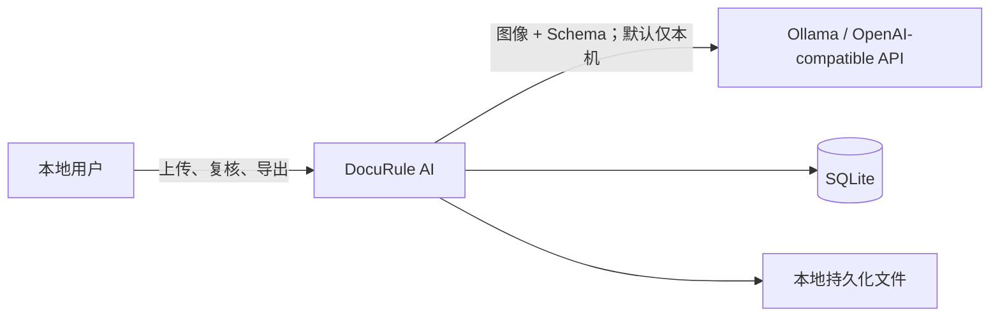
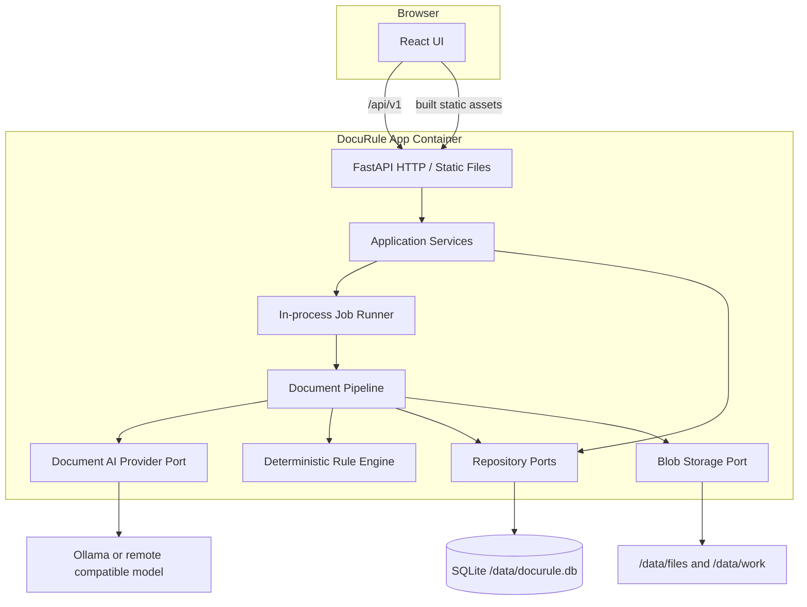
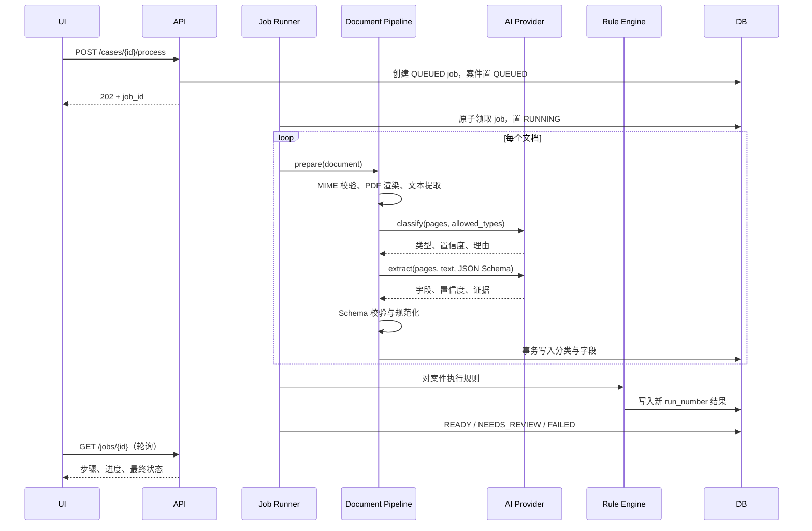

# DocuRule AI 技术架构

> 实施状态（2026-08-12）：`v0.1` 已采用 React/Vite、FastAPI、SQLite、本地文件和单容器部署。本文同时记录目标扩展架构；持久化 Job Runner、独立审计表、PostgreSQL/S3/Worker 端口等标注的演进项尚未全部实现。当前运行事实以源码、README 与测试为准。

> 状态：MVP 实施基线
> 关联产品规格：[product-spec.md](./product-spec.md)

## 1. 架构目标与约束

架构优先级按顺序是：

1. **首次运行简单**：Docker Compose 一条命令启动，不依赖外部数据库、Redis 或云服务。
2. **本地优先**：默认连接宿主机 Ollama，文件与结构化结果保存在本地挂载目录。
3. **端到端可解释**：字段保留证据，规则保留输入快照，人工修改保留审计事件。
4. **可替换而不过度设计**：MVP 使用 SQLite、本地文件和同进程任务，但通过端口隔离 PostgreSQL、S3、独立 Worker 和其他模型实现。
5. **失败可恢复**：处理状态写入数据库；浏览器刷新或进程重启不会让案件永久卡住。

MVP 技术栈：

- Web：React、Vite、TypeScript；
- API：Python 3.12、FastAPI、Pydantic v2；
- 数据库：标准库 `sqlite3`，以领域对象 JSON 作为当前持久化边界；
- 文件：本地持久化卷；
- 文档处理：`pypdf` 提取文本层；图片交由已配置的视觉模型处理；
- AI：统一的 Document AI 端口；默认 Ollama 原生适配器，并提供通用 OpenAI-compatible 多模态适配器；
- 测试：pytest 后端单元/API 测试、TypeScript 编译、Vite 生产构建和 Docker 镜像构建；
- 分发：多阶段 Dockerfile + Docker Compose。

## 2. 系统上下文



DocuRule AI 是数据和状态的唯一权威来源。模型只返回候选分类与字段，不直接决定案件批准/拒绝；最终状态由确定性规则和人工动作产生。

## 3. 运行时组件



生产镜像使用前端构建阶段生成静态文件，由 FastAPI 同域提供页面和 API。这样避免额外反向代理、CORS 和第二个运行容器。开发模式仍可分别运行 Vite dev server 与 FastAPI，并由 Vite 代理 `/api`。

### 3.1 组件职责

| 组件 | 职责 | 不负责 |
| --- | --- | --- |
| React UI | 上传、轮询进度、呈现证据、复核、导出 | 维护权威状态、持有模型 key |
| API routes | HTTP 校验、状态码、请求 ID、DTO 转换 | 业务状态迁移、直接访问磁盘 |
| Application services | 用例编排、事务边界、权限占位、状态迁移 | 模型厂商细节 |
| Job runner | 有界并发、任务领取、启动恢复、重试入口 | 业务提取逻辑 |
| Document pipeline | 准备、分类、提取、规范化、校验和进度 | HTTP 表现层 |
| Rule engine | 纯函数方式执行版本化规则 | 调用 LLM 判断确定性规则 |
| Provider adapter | 请求模型、能力降级、超时、响应 Schema 修复 | 持久化案件 |
| Repository ports | 领域对象持久化和查询 | 依赖 Web DTO |
| Blob storage port | 原件、派生页、临时文件生命周期 | 暴露宿主机绝对路径 |

## 4. 后端分层与依赖规则

推荐使用轻量六边形分层，边界由 Python Protocol/抽象类表达，不需要引入大型框架：

```text
api -> application -> domain
                 -> ports <- adapters
pipeline -> domain + ports
```

- `domain` 只包含实体、值对象、状态迁移、规则运算符和领域错误；不能导入 FastAPI、SQLAlchemy 或具体模型 SDK。
- `application` 实现新建案件、上传、开始处理、编辑字段、决策和导出等用例。
- `ports` 定义仓库、Blob、DocumentAIProvider、Clock、IDGenerator 接口。
- `adapters` 实现 SQLite、文件存储、OpenAI-compatible 和 mock provider。
- `api` 负责把领域错误稳定映射为 HTTP 错误格式。

这一边界是未来迁移 PostgreSQL/S3/Worker 的主要保证；不要求每个简单函数都额外包装一层。

## 5. 建议目录

```text
docurule-ai/
├── apps/
│   ├── web/
│   │   ├── src/
│   │   │   ├── api/
│   │   │   ├── components/
│   │   │   ├── features/{cases,documents,review,settings}/
│   │   │   ├── routes/
│   │   │   └── test/
│   │   └── package.json
│   └── api/
│       ├── app/
│       │   ├── api/v1/
│       │   ├── application/
│       │   ├── domain/
│       │   ├── ports/
│       │   ├── adapters/{ai,database,storage}/
│       │   ├── pipeline/
│       │   ├── core/{config,logging,errors}/
│       │   └── main.py
│       ├── migrations/
│       ├── tests/{unit,integration,contract}/
│       └── pyproject.toml
├── templates/
│   └── expense-reimbursement/
│       ├── template.yaml
│       ├── document-types/*.schema.json
│       ├── prompts/*.md
│       └── rules.yaml
├── samples/expense-reimbursement/
├── docs/
├── scripts/
├── .env.example
├── compose.yaml
├── Dockerfile
├── LICENSE
└── README.md
```

模板和样例放在顶层是有意选择：它们是贡献者最容易理解和扩展的公共接口，不应藏在后端包内部。

## 6. 处理流水线



### 6.1 步骤与事务

1. `PREPARE`：检查文件、统计页数、渲染页图、提取 PDF 原生文本；派生文件写入 work 目录。
2. `CLASSIFY`：限定候选标签，请模型给出单一类型和置信度；响应经 Pydantic 校验。
3. `EXTRACT`：使用该类型 JSON Schema；长 PDF 分批处理后确定性合并。
4. `NORMALIZE`：金额用 `Decimal`、日期用明确格式列表，不允许浮点金额。
5. `VALIDATE`：纯函数执行所有规则，完整写入一个新的 `run_number`。
6. `FINALIZE`：根据低置信度字段、失败文档和最新规则计算案件状态。

每个文档的分类与字段在一个数据库事务中提交。规则结果按 run 原子写入，任何时刻 API 只展示最新一个完整 run，避免出现半套规则结果。

### 6.2 幂等与重试

- `POST /process` 只允许 `DRAFT`/`FAILED`；同一案件已有 `QUEUED` 或 `RUNNING` Job 时返回 `409` 和现有 Job ID。
- 每个 Job 使用数据库中的不可变 ID。模型调用可重试最多 2 次，采用短指数退避，只重试超时、429、5xx 和可修复的输出格式错误。
- 不重试内容安全拒绝、模型不支持图片或超过上下文等确定性错误。
- 重试案件时创建新 Job，并清理/替换该文档当前派生结果；原始模型结果和 Job 历史保留。
- 服务启动时把遗留 `RUNNING` Job 标记回 `QUEUED` 并增加 attempt；超过最大 Job attempt 后置 `FAILED`。MVP 只运行一个 Uvicorn worker，防止多进程各自启动 Runner。

## 7. Document AI Provider

业务层依赖统一端口，而不是直接依赖 Ollama SDK：

```python
class DocumentAIProvider(Protocol):
    async def health(self) -> ModelHealth: ...
    async def classify(
        self, pages: list[ImageInput], text: str | None, candidates: list[DocumentType]
    ) -> Classification: ...
    async def extract(
        self, pages: list[ImageInput], text: str | None, schema: dict
    ) -> Extraction: ...
```

MVP 实现：

- `OllamaDocumentAIProvider`：调用 Ollama 原生模型、聊天和结构化输出接口，负责其图片编码与健康探测差异。
- `OpenAICompatibleDocumentAIProvider`：调用 `/v1/chat/completions` 或兼容 Responses 的封装，支持用户配置的兼容服务。
- `FixtureDocumentAIProvider`：根据样例 SHA-256 返回版本化 fixture，只用于测试和显式 demo/test 配置，生产默认禁用。

### 7.1 结构化输出策略

1. provider 能力探测支持 JSON Schema 时，使用原生 `response_format`；
2. 不支持时，提示模型只输出 JSON，并剥离合法 code fence；
3. 用 Pydantic/JSON Schema 校验；
4. 只针对格式问题携带简短校验错误重试一次；
5. 仍失败则记录安全的错误摘要，不把整份文档或完整模型响应写日志。

分类与提取提示词必须包含模板版本和 prompt 版本。记录 provider、model 和 prompt version，便于问题复现，但不保存 API key。

### 7.2 多页与图像约束

- 图片进入模型前修正方向、转换 RGB、限制最长边和总像素；原件不修改。
- 默认单次最多发送 4 页；更多页按批处理，字段按 Schema 合并：标量优先选择置信度高且非空者，数组按稳定 key 去重，冲突标记为待复核。
- 分类可先用缩略页；提取使用满足清晰度的页图。
- 原生 PDF 文本只作为补充，不当作可信字段结果；它必须和图片一起受上传限制保护。

## 8. 规则引擎

规则引擎必须是无网络调用、可重复、可单元测试的纯逻辑组件：

```text
RuleDefinition + CaseFacts -> ValidationResult
```

实现原则：

- 字段引用在模板加载时编译，运行时查找不到时按 `on_missing` 输出结果。
- 金额全部使用 `Decimal`，显式指定 tolerance；日期使用 UTC/无时区的业务日期类型，不隐式按服务器时区转换。
- 字符串默认只做 Unicode normalize + trim；是否忽略大小写、空格或标点必须由规则参数说明。
- 一条规则异常不能中断其他规则；输出 `FAIL` 且携带内部可观测错误码，面向用户的信息不含堆栈。
- 每次重算生成新的 `run_number` 和输入值快照；API 默认只返回最新 run，可通过审计/调试接口查看历史。

LLM 判断模糊语义规则属于后续能力，必须与确定性规则使用不同 operator 和结果标识，MVP 不实现。

## 9. 数据与存储

### 9.1 SQLite

- 数据库路径默认 `/data/docurule.db`，启用 WAL、foreign keys 和 busy timeout。
- 使用 Alembic 管理迁移；容器启动时执行迁移，迁移失败则应用不进入 ready。
- 写事务保持短小，不在事务中等待模型网络调用。
- Job 领取使用带状态条件的原子 UPDATE；单实例下足够安全。
- JSON 字段使用 SQLAlchemy JSON，保持未来 PostgreSQL JSONB 迁移可能。

SQLite 是体验优先选择，不宣称支持多实例共享。PostgreSQL 适配时保持领域仓库接口和 API 不变。

### 9.2 本地文件布局

```text
/data/
├── docurule.db
├── files/{case_id}/{document_id}/original
├── work/{case_id}/{document_id}/pages/page-0001.webp
└── exports/{case_id}/（可选缓存）
```

- 物理文件名不包含用户原始文件名；数据库保存展示名。
- 写入采用临时文件 + 原子 rename，避免半文件。
- 删除案件时先在事务中标记删除，再删除文件；文件失败写入清理队列/日志以便重试。
- 导出优先流式生成，不长期缓存敏感结果。
- `BlobStorage` 接口只接收 storage key；本地路径解析必须确认最终路径仍位于 `/data` 下。

### 9.3 未来扩展映射

| MVP | 扩展实现 | 保持不变的边界 |
| --- | --- | --- |
| SQLite | PostgreSQL | Repository ports、领域实体、API DTO |
| LocalBlobStorage | S3/MinIO | BlobStorage port、storage key |
| InProcessJobRunner | Celery/RQ/Arq/云队列 | Job 表、pipeline command、状态流 |
| 单实例 | API + 多 Worker | 原子领取/锁、幂等步骤 |

## 10. 配置与部署

`.env.example` 至少提供：

```dotenv
DOCURULE_DATABASE_URL=sqlite:////data/docurule.db
DOCURULE_STORAGE_ROOT=/data
DOCURULE_AI_PROVIDER=ollama
DOCURULE_AI_BASE_URL=http://host.docker.internal:11434
DOCURULE_AI_API_KEY=ollama
DOCURULE_AI_MODEL=qwen2.5vl:7b
DOCURULE_AI_TIMEOUT_SECONDS=120
DOCURULE_AI_MAX_RETRIES=2
DOCURULE_JOB_CONCURRENCY=1
DOCURULE_LOW_CONFIDENCE_THRESHOLD=0.75
DOCURULE_MAX_FILE_MB=25
DOCURULE_MAX_FILES_PER_CASE=20
DOCURULE_MAX_PDF_PAGES=50
DOCURULE_LOG_LEVEL=INFO
```

模型名称必须以 README 的已验证矩阵为准；环境示例中的名称不是对所有 Ollama 版本的兼容性保证。

Compose 默认仅含 `app` 服务、持久化 named volume 和 `host.docker.internal:host-gateway` 映射；不自动下载数 GB 模型。端口默认绑定 `127.0.0.1:8080`。可在后续提供 `ollama` profile，但不得让默认启动隐式拉取模型。

健康语义：

- `/health`：进程 event loop 正常即 200；
- `/readiness`：数据库可查询、存储可读写、模板有效时 ready。模型不可达返回 `200` 且总体 `degraded`，让 UI 能启动并指导用户；
- `/system/capabilities`：单独报告模型 `connected|unavailable|incompatible`。只有处理接口在模型不可用时返回 `503 MODEL_UNAVAILABLE`。

## 11. 安全与隐私

- 默认本机绑定且无认证；README 明确禁止直接暴露公网。生产化认证属于 0.3。
- 通过魔数和解析器验证文件，不信任浏览器 MIME；禁止 SVG/HTML 和压缩包。
- 对文件数、字节、页数、像素和模型请求体设上限，防止解压/像素炸弹和资源耗尽。
- PDF/图片解析在非特权容器用户下执行；容器文件系统除 `/data` 外尽量只读。
- 用户文件不可作为提示词指令执行；系统提示明确把文档内容视为不可信数据，并限制输出为 Schema。
- 日志只记录 request ID、case/document ID、步骤、耗时、模型状态和错误码；默认不记录字段值、原文、base64 图片、完整提示词/响应。
- 远程 provider 是用户显式配置行为；UI 需显示“文档将发送到所配置模型地址”，不得根据模型名自动选择云地址。
- API key 只存在服务端环境/secret，前端 capabilities 响应只显示 `configured: true/false`。
- 导出和原文件响应使用安全的 `Content-Disposition`、`nosniff` 与正确 MIME。

## 12. 可观测性

- 每个 HTTP 请求生成/透传 `X-Request-ID`；Job、模型调用和日志携带 case/job/document ID。
- 结构化日志字段：`event`、`request_id`、`case_id`、`job_id`、`document_id`、`step`、`duration_ms`、`attempt`、`error_code`。
- Pipeline 为每一步记录开始/完成/失败和耗时，不记录业务内容。
- MVP capabilities 页面提供近期 Job 的安全错误说明。Prometheus/OpenTelemetry 属于 0.2+，但应用服务中保留计时器接口。

## 13. API 与前端状态策略

- 后端状态始终是权威来源；前端不根据已完成请求自行推断下一状态。
- 使用生成的 OpenAPI TypeScript client 或在 CI 中检查手写类型与 Schema 的一致性。
- 数据请求建议使用 TanStack Query；轮询仅在 `QUEUED|PROCESSING` 时启用，间隔 1–2 秒，窗口隐藏时降频。
- 字段编辑携带 `version`；收到 `409 VERSION_CONFLICT` 时显示服务端新值并让用户决定是否重试。
- 大型聚合详情可以先由 `/cases/{id}` 返回摘要，再按 document 加载字段；MVP 数据量小，优先清晰实现。
- 所有用户可见状态有文字和图标，不只依赖颜色；字段编辑和拖拽上传可键盘操作。

## 14. 测试策略

### 14.1 单元测试

- 所有案件/文档状态迁移和非法迁移；
- 规则运算符、缺失值策略、Decimal tolerance、日期边界；
- 规范化、字段合并、低置信度计算；
- storage key 路径穿越、文件限制、MIME 检测；
- provider 响应解析、Schema 失败和重试判定。

### 14.2 集成与契约测试

- SQLite repository + Alembic 从空库迁移；
- 本地 Blob 生命周期；
- FastAPI 端点、错误 envelope、乐观锁和状态码；
- Mock provider 驱动完整的上传→处理→修改→重算→批准→导出；
- OpenAPI Schema 快照或兼容性检查。

### 14.3 真实模型冒烟

真实 Ollama 测试带 marker，默认 CI 不运行；发布候选在已验证硬件/模型上执行。断言关注 Schema 合法、分类在候选集、关键字段非空、任务能终止，不断言自然语言理由或精确置信度。

### 14.4 前端与 E2E

- 组件测试覆盖上传校验、进度/失败/离线状态、字段编辑冲突和规则详情。
- E2E 使用 fixture provider，覆盖产品规格中的确定性演示链路。
- Docker smoke test 构建最终镜像、迁移空卷、请求 health/readiness，并完成一次 fixture 流程。

## 15. 关键架构决策记录

### ADR-001：SQLite 与本地文件作为默认

**决定**：MVP 默认 SQLite + 本地卷。
**原因**：把首次启动依赖降到 Docker 和模型；符合本地隐私定位。
**代价**：不支持多实例和高并发；通过 Repository/Blob ports 保留迁移路径。

### ADR-002：同进程持久化任务 Runner

**决定**：API 进程内运行有界后台 Runner，Job 状态先写数据库。
**原因**：避免 Redis/队列成为首次使用前置条件，同时允许刷新和重启恢复。
**代价**：MVP 必须单 Uvicorn worker；生产化用相同 Job/Pipeline 契约替换为独立 Worker。

### ADR-003：统一 OpenAI-compatible 模型端口

**决定**：Ollama 和远程兼容模型共享 Document AI provider 端口，分别处理协议差异；业务层只认识分类/提取能力。
**原因**：默认本地，用户又能用已有兼容服务；降低厂商耦合。
**代价**：不同服务的 structured output/vision 差异由 capabilities 和降级策略处理，并建立验证矩阵。

### ADR-004：确定性规则不调用 LLM

**决定**：MVP 规则引擎只实现确定性运算符。
**原因**：结果可复现、可解释、易测试；模型只负责把文档转成事实。
**代价**：模糊语义判断延后，并在未来作为显式不同类型的规则提供。

### ADR-005：模板随仓库版本管理

**决定**：0.1 模板由 YAML/JSON Schema/Markdown 文件组成，启动时加载。
**原因**：可 code review、容易贡献、无需先开发复杂编辑器。
**代价**：非技术用户不能在 UI 新建模板；0.2 增加编辑和导入导出。

## 16. 实施顺序

1. 建立领域状态、SQLite/Alembic、文件存储和基础 API；
2. 实现模板加载校验和 fixture provider；
3. 完成上传→Job→Pipeline→规则→导出的确定性闭环；
4. 接入 React 页面和进度恢复；
5. 实现 OpenAI-compatible/Ollama provider 与真实模型冒烟；
6. 完成人工复核、乐观锁、审计与失败恢复；
7. Docker、CI、合成样例、README/GIF 和发布验收。

前四步完成前，不应扩展多租户、可视化规则编辑器或额外业务模板；这些功能不会证明核心闭环成立。
