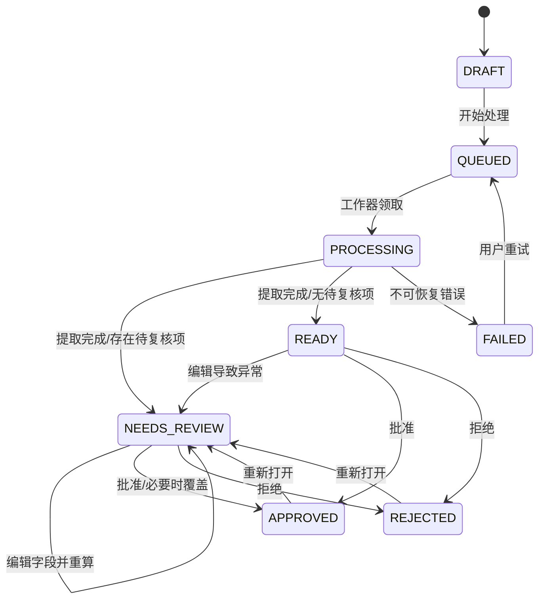

# DocuRule AI 产品规格

> 实施状态（2026-08-12）：当前仓库已经实现三文档采购三单匹配 Hero Demo、公开 recipe/golden fixture、双文档医疗理赔 Demo、字段证据、规则重算、人工决定、JSON 审计导出、Docker 与 Ollama。任意 YAML recipe 的运行时导入、乐观锁、独立审计实体和持久化任务运行器仍属于后续目标，不能视为现成功能。当前能力以 README 和自动化测试为准。

> 状态：MVP 开发基线
> 版本：0.1
> 目标读者：产品、设计、前后端开发、测试、开源贡献者

## 1. 产品定位

DocuRule AI 是一个本地优先、可自托管的开源文档智能与规则核验工作台。用户把一组 PDF、JPG 或 PNG 文件放入一个“案件（Case）”，系统自动完成：

1. 文档分类；
2. 按类型提取结构化字段；
3. 规范化日期、金额等字段；
4. 执行单文档和跨文档规则；
5. 将低置信度字段和规则异常送入人工复核；
6. 导出带证据、校验结果和审计记录的结果。

MVP 默认使用本机 Ollama，并允许通过配置切换到任意 OpenAI-compatible 多模态接口。首次运行只依赖 Docker 和一个可用的视觉模型，不要求用户另行安装 PostgreSQL、Redis 或对象存储。

一句话价值主张：

> Upload documents. Extract facts. Validate rules. Review exceptions.

## 2. 目标与成功信号

### 2.1 产品目标

- 让新用户在 5 分钟内理解产品，并在模型已准备好的情况下完成第一个演示案件。
- 提供一条可见、可解释、可复核的端到端链路，而不是只返回一段无法追溯的 JSON。
- 默认本地处理文档；除非用户明确配置远程模型，文档和提取内容不离开本机。
- 用稳定的领域模型和适配器接口支持未来替换数据库、存储、任务队列和模型服务。
- 仓库首页能够用一张流程图或短 GIF 展示从上传到核验通过的完整闭环。

### 2.2 MVP 成功信号

- `docker compose up --build` 后，浏览器能访问产品，无需配置外部数据库。
- 内置示例可稳定展示 3 种文档类型、8 个归一化字段和 6 条规则，其中包含供应商、PO 号、币种、数量和金额的跨文档规则。
- 每个提取字段都能看到来源文档、页码、原始文本、置信度；有坐标时能展示定位信息。
- 人工修改字段后，相关规则自动重算，并留下修改前后值和操作原因。
- JSON 导出能够完整表达案件、文档、字段、规则结果和人工复核记录。

Star 数量是发布目标，不是产品内指标。产品建设重点是降低首次体验成本、提供一眼可懂的演示和形成可扩展的贡献边界。

## 3. 用户与使用场景

### 3.1 核心用户

- AI/后端开发者：寻找可自托管的 Document AI 参考实现或二次开发底座。
- 自动化工程师：需要把票据、申请表、证明材料转成结构化结果并执行规则。
- 业务运营/审核人员：只处理机器不确定或规则不通过的项目。
- 开源贡献者：贡献新的文档模板、规则运算符、模型或存储适配器。

### 3.2 MVP 演示场景：采购三单匹配

内置一组无隐私、可公开分发的合成材料：

- `purchase_order`：采购订单；
- `invoice`：发票；
- `delivery_note`：收货单。

建议提取字段：

| 文档类型 | 字段 |
| --- | --- |
| 采购订单 | `supplier_name`、`po_number`、`currency`、`ordered_quantity`、`unit_price` |
| 发票 | `supplier_name`、`po_number`、`currency`、`invoiced_quantity`、`unit_price`、`invoice_total` |
| 收货单 | `supplier_name`、`po_number`、`currency`、`received_quantity`、`unit_price` |

内置规则至少包括：

- 完整性：采购订单、发票和收货单全部存在；
- 跨文档一致：三份文档的供应商一致；
- 跨文档一致：三份文档的 PO 号一致；
- 跨文档一致：三份文档的币种一致；
- 数量范围：发票数量不得大于收货数量；
- 金额范围：发票总额不得大于收货数量乘以单价。

这些模板只用于证明通用能力；产品品牌和主界面不绑定“报销”或“保险”行业。

## 4. MVP 范围

### 4.1 案件与上传

- 新建案件并选择一个模板包。
- 单次选择多个 PDF/JPG/JPEG/PNG 文件上传。
- 默认限制：单文件 25 MB、每案件 20 个文件、每个 PDF 50 页；均可通过环境变量调整。
- 校验真实 MIME 类型和扩展名；拒绝加密 PDF、超限文件和不支持的格式，并返回可操作的错误信息。
- 使用内容 SHA-256 标识文件；同一案件内重复上传时提示并拒绝，不静默覆盖。
- 原始文件名仅用于展示；磁盘路径使用系统生成的 ID，防止路径穿越。

### 4.2 自动处理

- 用户明确点击“开始处理”后创建后台任务，接口立即返回任务 ID。
- PDF 按页渲染为模型可用图片，并尽可能提取原生文本作为附加上下文。
- 系统在模板允许的文档类型中分类，不开放任意标签生成。
- 按分类对应的 JSON Schema 提取字段。
- 金额统一为十进制定点字符串与币种，日期统一为 ISO 8601，原始值仍保留。
- 对模型响应进行 Schema 校验；解析失败时允许有限次数的格式修复/重试，失败后进入可重试的错误状态。
- 所有文档完成提取后执行规则，生成可解释的规则结果。

### 4.3 结果与证据

- 案件详情显示总体状态、处理进度、文档列表、字段与规则摘要。
- 文档详情显示预测类型、分类置信度、每个字段的原始值、规范化值、置信度、页码和边界框（模型可提供时）。
- 规则结果包含状态、严重级别、可读说明、实际参与比较的值和关联字段。
- 置信度统一使用 `[0, 1]`；默认 `< 0.75` 的字段进入人工复核，阈值可配置。
- 无证据或模型未提供坐标时，不伪造坐标；界面明确显示“未提供定位”。

### 4.4 人工复核

- 复核队列包含低置信度字段、缺失必填字段、`FAIL` 规则和处理异常。
- 用户可修改结构化字段，必须保留原始模型值；可选填写原因。
- 修改字段后，同一案件的规则立即重算。
- 用户可将案件批准或拒绝。
- 存在 `ERROR` 严重级别的失败规则时，批准必须提供覆盖原因；系统记录谁（MVP 固定为 `local-user`）、何时、为何覆盖。
- 所有修改、批准、拒绝和覆盖动作写入只追加的审计记录。

### 4.5 导出

- 支持下载 UTF-8 JSON；JSON 是 MVP 的权威导出格式。
- 支持字段平铺 CSV，复杂数组或对象使用 JSON 字符串编码；规则和审计记录仍以 JSON 为完整来源。
- 导出内容包含 `schema_version`，便于未来兼容。
- 导出不改变案件状态；同一状态下重复导出应产生语义相同的数据。

### 4.6 系统状态与设置

- 状态页显示 API、数据库、存储和模型连接是否可用，并显示当前模型名。
- API key 只从服务端环境变量读取，不返回给浏览器、不写入日志或导出。
- MVP 不提供账户系统；界面醒目标注“单机/可信网络使用”，默认只绑定本机端口。

## 5. 明确非目标

MVP 不承诺：

- 训练 OCR、版面分析或大模型；
- 对手写体、超大工程图纸、音视频或办公文档提供可靠解析；
- 零配置支持任意业务文档；文档类型、字段和规则需要模板定义；
- 企业级多租户、SSO、RBAC、计费、审批流编排或多人实时协作；
- 法律、医疗、财务结论的正确性保证；
- 高可用、横向扩容或海量批处理；
- 在 MVP UI 中设计复杂 Schema 和规则。模板先以版本化 YAML/JSON 文件交付；
- 自动把真实用户文档上传到云端，也不内置遥测。

## 6. 核心概念与数据模型

### 6.1 概念

- **Template Pack**：一组允许的文档类型、字段 Schema、提示词和校验规则，随代码版本管理。
- **Case**：一次需要共同核验的材料集合，也是处理、复核和导出的边界。
- **Document**：用户上传的一个原始文件。
- **Field**：模型提取并规范化的最小事实，保留来源和置信度。
- **Validation Result**：某一规则在某次计算后的不可变结果；重算会生成新版本。
- **Review Action**：人工编辑、批准、拒绝或覆盖的审计事件。
- **Processing Job**：后台处理一次案件的执行记录。

### 6.2 逻辑实体

#### `cases`

| 字段 | 类型 | 约束/说明 |
| --- | --- | --- |
| `id` | UUID string | 主键 |
| `name` | string | 1–120 字符 |
| `template_id` | string | 模板稳定 ID |
| `template_version` | string | 创建时锁定版本 |
| `status` | enum | 见状态流 |
| `progress` | integer | 0–100，只用于展示 |
| `failure_code` / `failure_message` | nullable string | 对用户安全的错误信息 |
| `created_at` / `updated_at` | datetime | UTC ISO 8601 |
| `decided_at` | nullable datetime | 批准或拒绝时间 |

#### `documents`

| 字段 | 类型 | 约束/说明 |
| --- | --- | --- |
| `id` / `case_id` | UUID string | 主键/外键 |
| `original_name` | string | 仅展示 |
| `storage_key` | string | 服务端生成，API 不暴露物理路径 |
| `sha256` | string | 案件内唯一 |
| `mime_type` / `size_bytes` / `page_count` | scalar | 上传元数据 |
| `document_type` | nullable string | 模板中的类型 ID；人工可修订 |
| `classification_confidence` | nullable float | `[0, 1]` |
| `status` | enum | 文档处理状态 |
| `error_code` / `error_message` | nullable string | 单文档失败信息 |
| `created_at` / `updated_at` | datetime | UTC |

#### `document_fields`

| 字段 | 类型 | 约束/说明 |
| --- | --- | --- |
| `id` / `document_id` | UUID string | 主键/外键 |
| `field_key` / `label` | string | Schema 键与展示名 |
| `value` | JSON | 当前值 |
| `normalized_value` | JSON | 当前规范化值 |
| `model_value` / `model_normalized_value` | JSON | 首次模型结果，不覆盖 |
| `raw_text` | nullable string | 证据文本 |
| `confidence` | nullable float | `[0, 1]` |
| `page_number` | nullable integer | 从 1 开始 |
| `bbox` | nullable JSON | `{x,y,width,height}`，归一化到 `[0,1]` |
| `source` | enum | `model` 或 `human` |
| `version` | integer | 乐观并发控制 |
| `updated_at` | datetime | UTC |

#### `validation_results`

| 字段 | 类型 | 约束/说明 |
| --- | --- | --- |
| `id` / `case_id` | UUID string | 主键/外键 |
| `run_number` | integer | 每次重算递增 |
| `rule_id` / `rule_version` | string | 可追溯模板定义 |
| `status` | enum | `PASS`、`FAIL`、`WARN`、`SKIP` |
| `severity` | enum | `INFO`、`WARNING`、`ERROR` |
| `message` | string | 面向人的解释 |
| `actual_values` | JSON | 本次参与判断的值快照 |
| `field_refs` | JSON array | 关联的字段 ID |
| `created_at` | datetime | UTC |

#### `review_actions`

| 字段 | 类型 | 约束/说明 |
| --- | --- | --- |
| `id` / `case_id` | UUID string | 主键/外键 |
| `action` | enum | `FIELD_EDITED`、`TYPE_CHANGED`、`APPROVED`、`REJECTED`、`RULE_OVERRIDDEN` |
| `target_type` / `target_id` | string | 可选目标 |
| `before_value` / `after_value` | nullable JSON | 变更快照 |
| `reason` | nullable string | 覆盖错误时必填 |
| `actor` | string | MVP 为 `local-user` |
| `created_at` | datetime | UTC，不可更新 |

#### `processing_jobs`

| 字段 | 类型 | 约束/说明 |
| --- | --- | --- |
| `id` / `case_id` | UUID string | 主键/外键 |
| `status` | enum | `QUEUED`、`RUNNING`、`SUCCEEDED`、`FAILED` |
| `current_step` | enum | `PREPARE`、`CLASSIFY`、`EXTRACT`、`NORMALIZE`、`VALIDATE`、`FINALIZE` |
| `progress` | integer | 0–100，单调不减 |
| `attempt` | integer | 重试次数 |
| `error_code` / `error_message` | nullable string | 安全错误信息 |
| `started_at` / `finished_at` | nullable datetime | UTC |

物理表可以附加内部字段，但 API 不得泄露文件系统绝对路径、提示词中的秘密或 API key。

## 7. 状态流

### 7.1 案件状态



约束：

- `DRAFT` 可继续上传文件；开始处理后 MVP 不允许增删文件。需要更换材料时新建案件，0.2 再评估“复制为草稿”。
- `READY` 表示没有低置信度字段、处理错误或未覆盖的失败规则；它不是人工批准。
- 单个文档失败时案件进入 `NEEDS_REVIEW`；全部文档不可处理或基础设施失败时进入 `FAILED`。
- 重试复用原文件，创建新的 Job，不覆盖旧 Job 记录。

### 7.2 文档状态

`UPLOADED → PREPARING → CLASSIFYING → EXTRACTING → EXTRACTED`。任一步骤可进入 `FAILED`；用户重试后从 `PREPARING` 开始。人工改变文档类型后，该文档必须重新提取。

## 8. 模板与规则契约

模板包必须包含稳定的 `id`、语义化版本、文档类型列表、每种类型的 JSON Schema，以及规则列表。MVP 使用仓库内文件，服务启动时校验，模板有误应让健康检查降级并给出文件级错误。

建议规则表达：

```yaml
id: invoice_amount_matches_claim
version: 1
description: Claimed amount must equal invoice total
severity: ERROR
operator: equals
left: "doc:expense_claim.claimed_amount"
right: "doc:invoice.total_amount"
tolerance: "0.01"
on_missing: FAIL
```

MVP 运算符：

- `required(ref)`
- `equals(left, right)`，字符串在 trim 后比较，金额使用 Decimal；
- `number_range(ref, min, max)`；
- `date_order(left, right, max_days?)`；
- `regex(ref, pattern)`；
- `sum_equals(items, target, tolerance)`。

引用格式在模板加载时解析和校验。缺少值时必须按规则的 `on_missing: FAIL|WARN|SKIP` 处理，不允许由运算符隐式决定。

## 9. HTTP API 契约

统一前缀 `/api/v1`，请求与响应使用 JSON（上传除外），时间为 UTC ISO 8601，ID 为字符串。OpenAPI 文档由 FastAPI 生成并纳入接口测试。

### 9.1 端点

| 方法与路径 | 用途 | 成功状态 |
| --- | --- | --- |
| `GET /health` | 进程存活 | `200` |
| `GET /readiness` | 数据库、存储、模板状态；模型不可用可标为 degraded | `200`/`503` |
| `GET /system/capabilities` | 当前模型、支持格式、上传限制、模型连通性 | `200` |
| `GET /templates` | 模板摘要列表 | `200` |
| `GET /templates/{template_id}` | 模板字段与规则说明 | `200` |
| `POST /cases` | 新建案件 | `201` |
| `GET /cases` | 按状态分页列出案件 | `200` |
| `GET /cases/{case_id}` | 案件聚合详情 | `200` |
| `DELETE /cases/{case_id}` | 删除草稿案件及其文件 | `204` |
| `POST /cases/{case_id}/documents` | `multipart/form-data` 多文件上传 | `201` |
| `GET /documents/{document_id}` | 文档、字段和证据详情 | `200` |
| `GET /documents/{document_id}/content` | 内联查看原文件；校验归属 | `200` |
| `POST /cases/{case_id}/process` | 创建处理任务 | `202` |
| `POST /cases/{case_id}/retry` | 从失败状态创建新任务 | `202` |
| `GET /jobs/{job_id}` | 获取步骤、进度和错误 | `200` |
| `PATCH /fields/{field_id}` | 人工修订字段，随后重算规则 | `200` |
| `PATCH /documents/{document_id}/type` | 修订类型并触发重新提取 | `202` |
| `POST /cases/{case_id}/validate` | 手动重算规则 | `200` |
| `POST /cases/{case_id}/decision` | 批准、拒绝或重新打开 | `200` |
| `GET /cases/{case_id}/export?format=json|csv` | 下载导出 | `200` |

### 9.2 关键请求/响应

新建案件：

```json
POST /api/v1/cases
{
  "name": "August expense demo",
  "template_id": "expense-reimbursement"
}
```

开始处理：

```json
HTTP/1.1 202 Accepted
{
  "job_id": "01J...",
  "case_id": "01J...",
  "status": "QUEUED",
  "status_url": "/api/v1/jobs/01J..."
}
```

修改字段使用版本号避免两个页面互相覆盖：

```json
PATCH /api/v1/fields/01J...
{
  "value": "1280.50",
  "version": 2,
  "reason": "Corrected against the highlighted invoice total"
}
```

批准或拒绝：

```json
POST /api/v1/cases/01J.../decision
{
  "decision": "APPROVE",
  "reason": "Verified manually",
  "override_rule_ids": ["invoice_amount_matches_claim"]
}
```

### 9.3 错误格式

```json
{
  "error": {
    "code": "UNSUPPORTED_FILE_TYPE",
    "message": "Only PDF, PNG, JPG and JPEG files are supported.",
    "details": {"file": "notes.docx"},
    "request_id": "req_01J..."
  }
}
```

标准错误至少覆盖：`VALIDATION_ERROR (422)`、`NOT_FOUND (404)`、`INVALID_STATE (409)`、`VERSION_CONFLICT (409)`、`PAYLOAD_TOO_LARGE (413)`、`MODEL_UNAVAILABLE (503)` 和 `INTERNAL_ERROR (500)`。`500` 响应不得包含堆栈、提示词或本地路径。

## 10. 页面与交互

MVP 只需要四类路由：

1. `/`：案件列表、状态筛选、新建案件、系统状态提示；
2. `/cases/new`：选择模板、拖拽上传、上传校验、开始处理；
3. `/cases/:id`：进度、文档分类、字段表、规则结果、人工复核与导出；
4. `/settings`：只读显示模型、接口地址（隐藏敏感部分）、限制与连通性。

案件详情的默认信息层级：

- 顶部：案件状态、进度、主要操作；
- 摘要：通过/失败/警告规则数量与待复核字段数量；
- 左侧或标签页：文档列表与分类；
- 主区：字段和证据；
- 规则区：可展开查看参与判断的值；
- 审计区：按时间倒序显示人工动作。

处理中页面每 1–2 秒轮询 Job；完成或失败后停止。刷新页面后继续从服务端状态恢复，不能依赖浏览器内存维护进度。

## 11. MVP 验收标准

以下标准共同构成完整 MVP 的验收基线，不以“页面能打开”替代端到端验收。

### A. 安装与首次体验

- [ ] 在装有 Docker Compose 的干净环境，复制 `.env.example` 并执行 `docker compose up --build` 后应用可用；SQLite、表结构和数据目录自动创建。
- [ ] 未安装/未启动 Ollama 时，UI 仍可打开并明确显示模型不可用；点击处理得到可恢复错误，不出现无限加载。
- [ ] 配置可用 Ollama 视觉模型后，无需改代码即可通过 readiness/capabilities 看到模型已连接。
- [ ] 重启容器后，已上传案件、字段、规则结果和审计记录仍存在。

### B. 确定性演示链路

- [x] 内置合成采购材料；CI 无需真实模型即可走完整流水线，并断言 Demo 不调用 AI Provider。
- [x] 一键演示识别 `purchase_order`、`invoice`、`delivery_note`，展示 8 个归一化字段。
- [x] 初次规则执行固定产生 `4 PASS + 2 FAIL`，页面显示发票数量、收货数量、发票总额和已收货价值。
- [x] 将 `received_quantity` 从 `90` 修订为 `96` 后自动重算为 `6 PASS`。
- [x] 批准案件后导出的 JSON 包含 3 个文档、当前字段、最新规则结果及字段修改审计事件。

### C. 真实 Ollama 链路

- [ ] 使用 README 声明的视觉模型和内置样例，所有文档在合理超时内完成分类和提取；验收不要求模型产生完全相同的浮点置信度。
- [ ] 每类文档至少提取一个非空字段；模型无坐标时输出 `null` 而非虚构位置。
- [ ] 处理期间刷新浏览器，不丢失任务；任务完成后状态不再停留在 `PROCESSING`。
- [ ] 设置远程 OpenAI-compatible `base_url`、模型名和 key 后，不改业务代码即可执行同一流程。

### D. 失败、边界与安全

- [ ] 上传超限、伪造后缀、加密 PDF 和重复文件时得到明确的 4xx 错误，服务保持可用。
- [ ] 模型超时或返回非法 JSON 时有限重试，最终把文档/案件置于可理解的失败或待复核状态；不得无限重试。
- [ ] 两个客户端用相同版本修改字段时，一个成功、另一个得到 `409 VERSION_CONFLICT`。
- [ ] 未显式配置远程模型时，网络调用测试证明文档内容不会发送到 Ollama 地址以外的第三方服务。
- [ ] 日志、API 错误和前端响应中不包含 API key、文件绝对路径或完整文档正文。
- [ ] 删除草稿案件后，数据库记录和关联原始/派生文件均被删除；非草稿删除返回 `409`。

### E. 质量门槛

- [ ] 后端单元测试覆盖状态迁移、全部 MVP 规则运算符、金额/日期规范化和路径安全。
- [ ] API 集成测试覆盖上传→处理→编辑→重算→批准→导出。
- [ ] 前端至少覆盖新建上传、进度恢复、字段编辑冲突、模型离线提示。
- [ ] CI 执行格式检查、类型检查、单元/集成测试和 Docker 镜像构建。
- [ ] README 提供 5 分钟 Quick Start、Ollama 模型准备方式、远程 provider 配置、演示 GIF 和隐私说明。

## 12. 路线图

### 0.2 — 可演示 MVP

- 采购三单匹配 Hero Demo 和医疗理赔辅助 Demo；
- 上传、分类、提取、规则、复核、JSON 导出；
- Ollama 与 OpenAI-compatible；
- SQLite、本地存储、同进程任务；
- 合成样例、Mock provider、Docker Compose 和端到端测试。

### 0.3 — 可配置工作台

- Web Schema/规则编辑器与模板导入导出；
- OCR/文本抽取适配器、更多视觉模型验证矩阵；
- 批量案件、Webhook、结果回调；
- PostgreSQL、S3/MinIO 和独立 Worker 的官方部署 profile；
- 中英文界面、模板市场/贡献指南。

### 0.4 — 团队与生产化

- 用户、团队、RBAC、SSO；
- 审批队列、分派和 SLA；
- 可观测性、速率限制、备份恢复与横向扩容；
- 提取/分类评测集、模型对比和回归看板；
- 脱敏、保留策略和合规扩展点。

## 13. 发布前产品检查

- 首页首屏只表达一个闭环，不堆叠底层技术名词。
- 演示 GIF 在 20 秒内覆盖上传、自动分类、规则异常、人工修正、通过。
- 仓库的合成样例无商标、个人信息和不可再分发素材。
- 至少一位未参与开发的人按 README 从零完成演示，并记录耗时和卡点。
- Issue 模板明确区分 bug、模型兼容性、模板贡献和功能建议。
